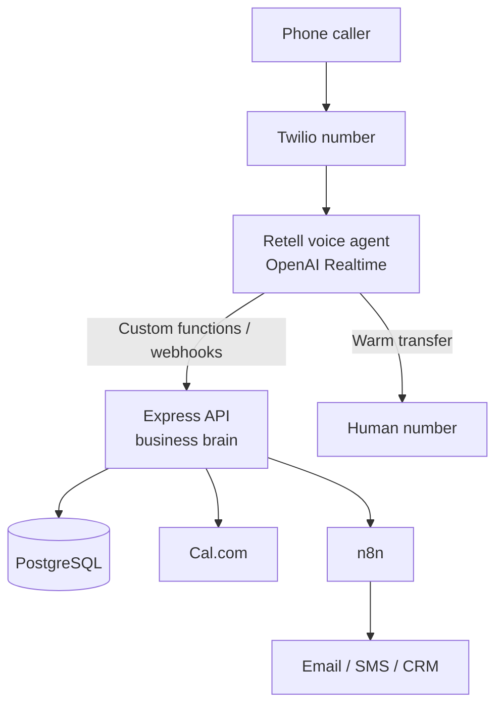
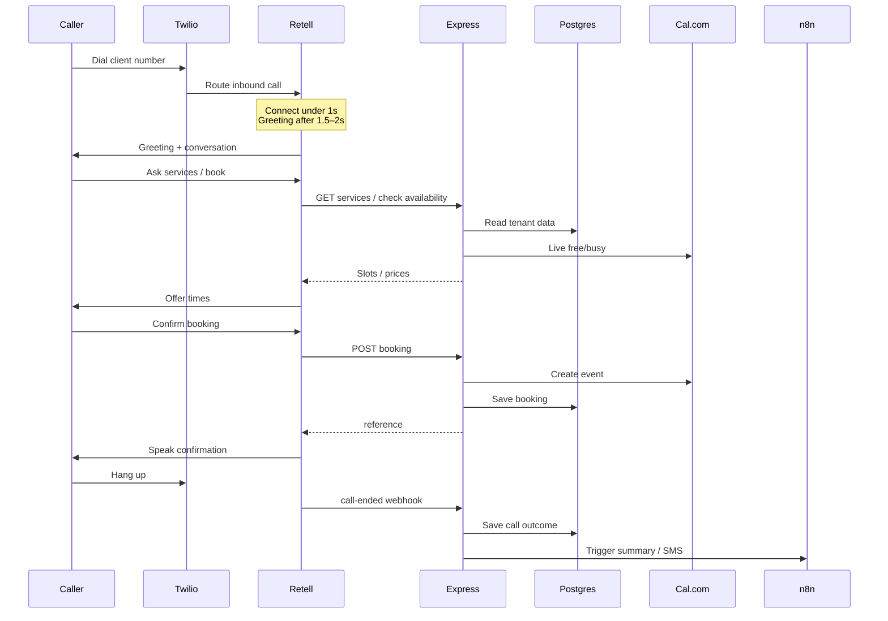
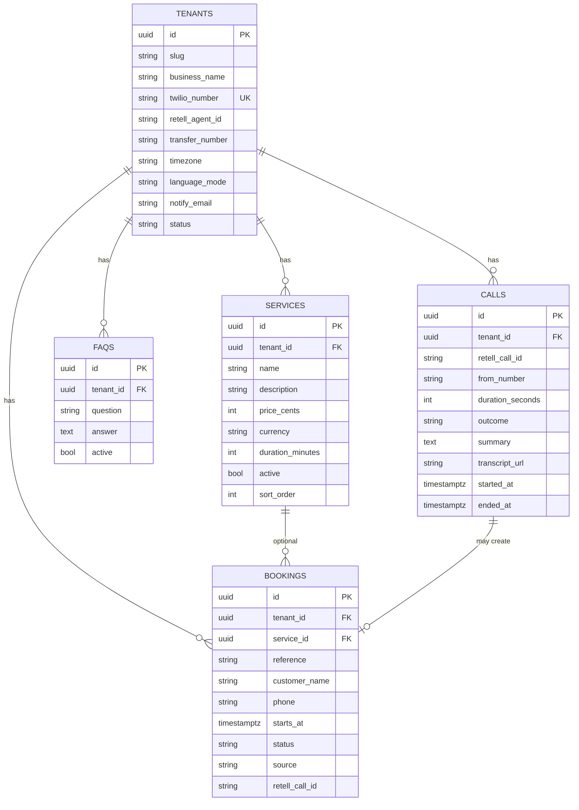

# Nexofy Voice Agent 1.0 — Architecture & Schema

Presentation pack for Sunday alignment.  
Phone-first production design: **Retell talks; Express + PostgreSQL own business truth.**

---

## 1. System architecture



### Responsibility split

| Layer | Owns | Does not own |
|---|---|---|
| Twilio | Phone number, PSTN routing | Conversation logic, bookings |
| Retell | Voice agent, Realtime talk, transcripts, transfer | Canonical prices, bookings DB |
| Express API | Tenant config, tools, validation, webhooks | Raw phone audio |
| PostgreSQL | Tenants, services, FAQs, bookings, call outcomes | Live audio stream |
| n8n | Email / SMS / CRM fan-out | Source of truth |
| Cal.com | Availability + calendar write | Client FAQs / CRM |

---

## 2. Call sequence (happy path)



---

## 3. Entity relationship diagram



**Isolation rule:** every query filters by `tenant_id`.  
One Twilio number maps to exactly one tenant.

---

## 4. SQL schema (draft)

```sql
create table tenants (
  id uuid primary key default gen_random_uuid(),
  slug text unique not null,
  business_name text not null,
  twilio_number text unique not null,
  retell_agent_id text,
  transfer_number text,
  timezone text not null default 'Africa/Johannesburg',
  language_mode text not null default 'standard', -- standard | dynamic
  notify_email text,
  notify_webhook_url text,
  status text not null default 'active',
  created_at timestamptz not null default now()
);

create table services (
  id uuid primary key default gen_random_uuid(),
  tenant_id uuid not null references tenants(id),
  name text not null,
  description text,
  price_cents integer not null,
  currency text not null default 'ZAR',
  duration_minutes integer not null,
  active boolean not null default true,
  sort_order integer not null default 0
);

create table faqs (
  id uuid primary key default gen_random_uuid(),
  tenant_id uuid not null references tenants(id),
  question text not null,
  answer text not null,
  active boolean not null default true
);

create table bookings (
  id uuid primary key default gen_random_uuid(),
  tenant_id uuid not null references tenants(id),
  service_id uuid references services(id),
  reference text not null,
  customer_name text not null,
  phone text not null,
  starts_at timestamptz,
  date_text text,
  time_text text,
  quoted_price text,
  notes text,
  status text not null default 'booked', -- booked | cancelled | rescheduled
  source text not null default 'twilio', -- twilio | web
  retell_call_id text,
  created_at timestamptz not null default now(),
  unique (tenant_id, reference)
);

create table calls (
  id uuid primary key default gen_random_uuid(),
  tenant_id uuid not null references tenants(id),
  retell_call_id text unique not null,
  from_number text,
  duration_seconds integer,
  outcome text, -- booked | enquiry | escalated | unresolved
  summary text,
  transcript_url text,
  booking_id uuid references bookings(id),
  started_at timestamptz,
  ended_at timestamptz,
  created_at timestamptz not null default now()
);

create index idx_services_tenant on services(tenant_id);
create index idx_faqs_tenant on faqs(tenant_id);
create index idx_bookings_tenant on bookings(tenant_id);
create index idx_calls_tenant on calls(tenant_id);
```

---

## 5. Express API surface (v1)

| Method | Endpoint | Called by | Job |
|---|---|---|---|
| GET | `/health` | Render / monitors | Liveness |
| GET | `/api/tenants/:id/services` | Retell tool | Price list |
| GET | `/api/tenants/:id/faqs` | Retell tool | Approved answers |
| POST | `/api/tenants/:id/availability` | Retell tool | Check Cal.com slots |
| POST | `/api/tenants/:id/bookings` | Retell tool | Create booking |
| POST | `/api/tenants/:id/bookings/:ref/cancel` | Retell tool | Cancel |
| POST | `/api/webhooks/retell/call-ended` | Retell webhook | Save call + trigger n8n |

---

## 6. Data ownership during a call

```text
During call
  Retell ........ transcript, recording, tool logs
  Express/DB .... services, FAQs, bookings (source of truth)

After call
  Retell webhook → Express → calls table
  Express/n8n ........... email summary, SMS, CRM row
```

Retell may also hold a **Knowledge Base copy** of FAQs.  
PostgreSQL remains the **source of truth**.

---

## 7. What is out of the production phone path

| Keep as optional | Not required for Nexofy phone v1 |
|---|---|
| React marketing site | Browser WebRTC call UI as core product |
| Portfolio demo widget | Express minting browser ephemeral tokens for phone |

---

## 8. Sunday talking points

1. Phone-first: Retell talks; Express + Postgres is the brain.  
2. One database for all clients; isolation by `tenant_id` + Twilio number mapping.  
3. React realtime demo is portfolio/widget — not the production path.  
4. Confirm with Nexofy: Cal.com primary, Retell mandatory, transfer number model.

---

Source: Nexofy SRD v1.0 (6 Aug 2026) + current realtime-voice-receptionist foundation.
